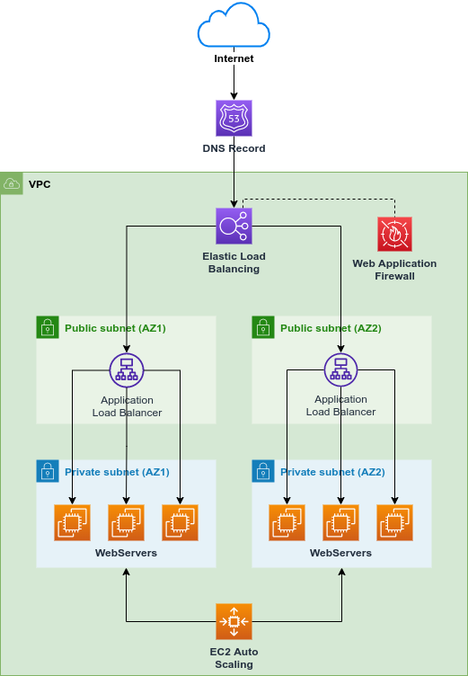

# Displayr Hello World

This project consists of a coding challenge for the DevOps / Platform Engineer role.

## Technologies

* Terraform v1.3.5
* Bash (Unix shell)

## Repository Structure

```
displayr/
├─ scripts/
│  ├─ health-check.sh     # Bash script for the web server health check.
├─ terraform/
│  ├─ data.tf             # Terraform data sources.
│  ├─ dev.tfvars          # Variables set for the dev environment.
│  ├─ main.tf             # Terraform resources.
│  ├─ providers.tf        # Terraform configuration for the AWS registry.
│  ├─ variables.tf        # Terraform input variables.
│  ├─ versions.tf         # Terraform settings block.
```

## Getting started

1. Clone the repository `git@github.com:osiro/displayr.git`
2. Export AWS Credentials to deploy the solution to AWS:

```bash
export AWS_ACCESS_KEY_ID="ASIA..."
export AWS_SECRET_ACCESS_KEY="..."
export AWS_SESSION_TOKEN="..."
export AWS_DEFAULT_REGION="us-east-1"
```

3. Visit the terraform directory by running: `cd terraform`
4. Deploy the stack by running: `terraform apply -auto-approve -var-file="dev.tfvars"`

This should output the address of the Webserver as follows:

```bash
Outputs:

webserver_address = "http://1.2.3.4"
```

## Tear down

1. Export AWS Credentials to deploy the solution to AWS: (in case the above has expired or lost)

```bash
export AWS_ACCESS_KEY_ID="ASIA..."
export AWS_SECRET_ACCESS_KEY="..."
export AWS_SESSION_TOKEN="..."
export AWS_DEFAULT_REGION="us-east-1"
```

2. Visit the terraform directory by running: `cd terraform`
3. Deploy the stack by running: `terraform apply -auto-approve -var-file="dev.tfvars" -destroy`

This should remove all the resources created within this stack only.

## Health-check

You can start the health-check script by running: `./scripts/health-check.sh`.

## Final considerations

The development of this solution aims to validate my DevOps knowledge within the scope of the requirements specified below:

> - You will need an AWS/Azure account for this task. You are expected to use free-tier only.
> - You can use any infrastructure as code tool you like.
> - The code must be able to run anywhere.
> - Provide a script to run health checks periodically and externally.
> - Provide documents of the code.
> - Automate as much as possible.
> - The code must be stored in a source control tool of your choice and a link must be provided

However, I want to emphasise that I have only implemented this solution as a coding challenge. Hence, I would not use this as a baseline to solve a real-world problem, as it does not comply with security best practices and the AWS Well-Architected Framework.

See image below for a solution I would adopt in a real-world scenario:


